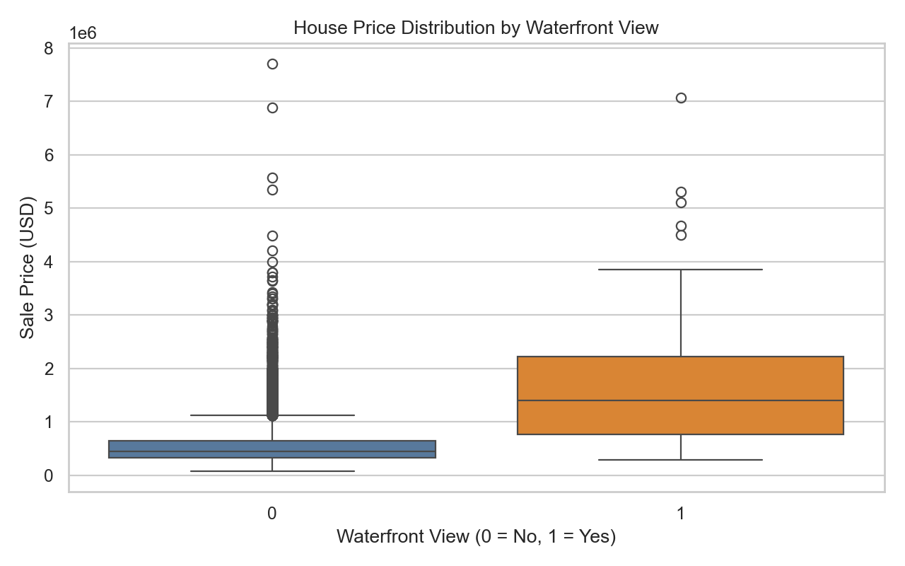
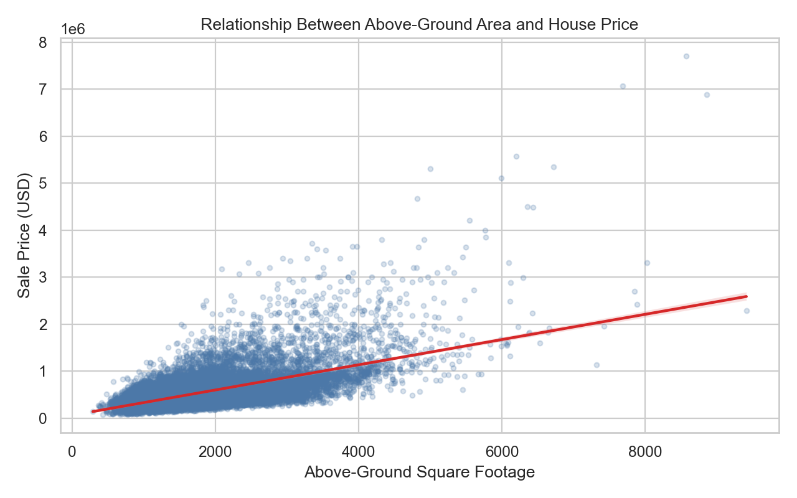
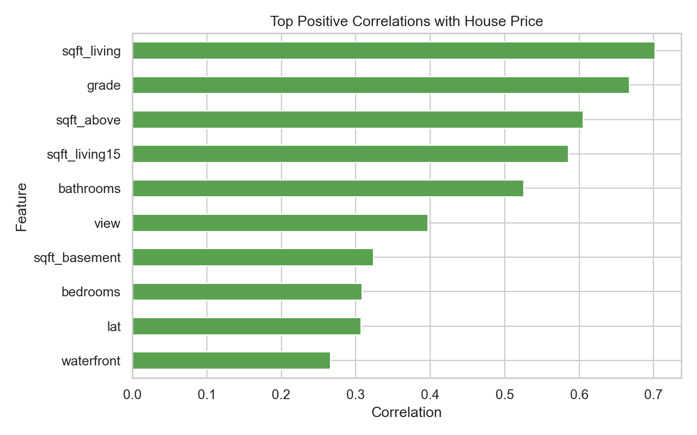
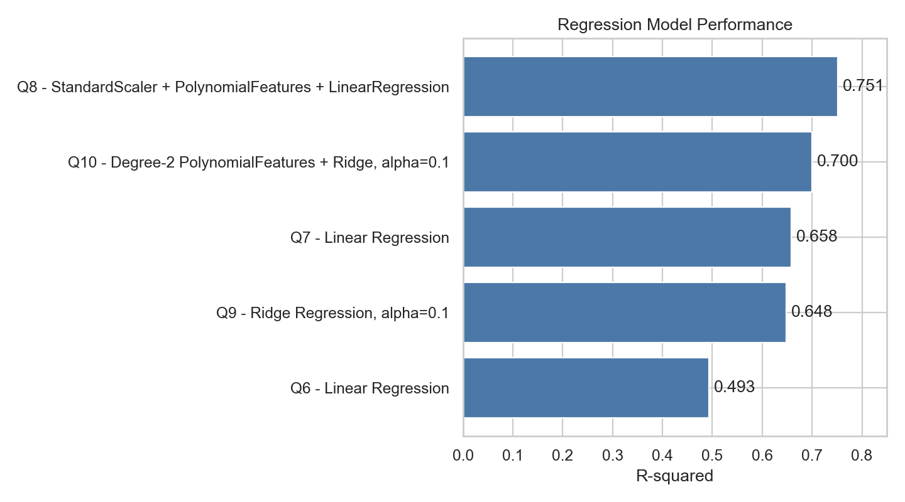

# King County House Sales Analysis

Python-based exploratory data analysis and regression modeling project using King County, Washington house sales data. The project demonstrates a full analysis workflow: data loading, data wrangling, feature exploration, visualization, model development, and model evaluation.

## Project Purpose

This repository presents the IBM data science final project as a professional analysis case study. The notebook investigates how housing attributes such as living area, grade, waterfront status, location, number of bathrooms, and basement size relate to sale price. It then builds several regression models to estimate house prices and compares their R-squared performance.

## Business Scenario

The analysis is framed from the perspective of a real estate investment trust that wants to estimate residential property prices from observable house characteristics. The goal is not only to train a model, but also to explain which variables are useful, how the data is prepared, and how model performance changes as the modeling approach becomes more advanced.

## Dataset

| Item | Details |
| --- | --- |
| Dataset file | `data/housing.csv` |
| Notebook | `notebooks/House_Sales_in_King_Count_USA.ipynb` |
| Records | 21,613 house sales |
| Original columns | 22 |
| Cleaned modeling columns | 20 |
| Location | King County, Washington, USA, including Seattle |
| Sale period | May 2014 to May 2015 |
| Prediction target | `price` |

## Feature Dictionary

| Variable | Description |
| --- | --- |
| `id` | House identifier |
| `date` | Date the house was sold |
| `price` | Sale price, used as the prediction target |
| `bedrooms` | Number of bedrooms |
| `bathrooms` | Number of bathrooms |
| `sqft_living` | Square footage of living space |
| `sqft_lot` | Square footage of the lot |
| `floors` | Number of floors |
| `waterfront` | Whether the house has a waterfront view |
| `view` | View quality indicator |
| `condition` | Overall property condition |
| `grade` | King County housing grade |
| `sqft_above` | Square footage above ground level |
| `sqft_basement` | Square footage of basement |
| `yr_built` | Year built |
| `yr_renovated` | Year renovated |
| `zipcode` | ZIP code |
| `lat` | Latitude |
| `long` | Longitude |
| `sqft_living15` | Nearby living-area reference in 2015 |
| `sqft_lot15` | Nearby lot-size reference in 2015 |

## Notebook Criteria Covered

| Criteria | Repository interpretation | Technique demonstrated |
| --- | --- | --- |
| Q1 | Inspect column data types | `df.dtypes` |
| Q2 | Remove non-predictive ID fields and summarize cleaned data | `drop()`, `describe()` |
| Q3 | Count houses by floor category | `value_counts().to_frame()` |
| Q4 | Compare waterfront and non-waterfront price outliers | seaborn `boxplot()` |
| Q5 | Test whether `sqft_above` is positively or negatively related to price | seaborn `regplot()` |
| Correlation task | Identify numeric features most correlated with `price` | pandas `corr()` |
| Q6 | Build a simple linear regression using `sqft_living` | `LinearRegression` |
| Q7 | Build a multivariable linear regression model | `LinearRegression` with selected features |
| Q8 | Build a preprocessing and polynomial regression pipeline | `Pipeline`, `StandardScaler`, `PolynomialFeatures` |
| Q9 | Evaluate Ridge regression on train/test data | `train_test_split`, `Ridge(alpha=0.1)` |
| Q10 | Evaluate polynomial Ridge regression | degree-2 `PolynomialFeatures` + `Ridge` |

## Data Preparation

The notebook follows a clear cleaning path before modeling:

1. Load the King County sales dataset.
2. Inspect shape, sample rows, data types, and descriptive statistics.
3. Remove `id` and `Unnamed: 0` because they are identifiers rather than predictive housing attributes.
4. Detect missing values in `bedrooms` and `bathrooms`.
5. Replace missing bedroom and bathroom values with each column mean.
6. Use the cleaned dataset for EDA, correlation analysis, and modeling.

## Dataset Profile

| Metric | Value |
| --- | ---: |
| Rows | 21,613 |
| Columns after cleanup | 20 |
| Median sale price | 450,000 |
| Average sale price | 540,088.14 |
| Minimum sale price | 75,000 |
| Maximum sale price | 7,700,000 |
| Missing bedrooms after imputation | 0 |
| Missing bathrooms after imputation | 0 |

## Exploratory Analysis

### Floor Distribution

The floor-count task shows that one-floor and two-floor houses dominate the dataset.

| Floors | House count |
| ---: | ---: |
| 1.0 | 10,680 |
| 1.5 | 1,910 |
| 2.0 | 8,241 |
| 2.5 | 161 |
| 3.0 | 613 |
| 3.5 | 8 |

### Waterfront Price Outliers

Question 4 is reproduced with seaborn. Waterfront properties show a much wider price range and more extreme high-price outliers than non-waterfront properties.

<p align="center">
  
</p>

### Above-Ground Area and Price

Question 5 is reproduced with seaborn's regression plot. The trend is positive: larger above-ground square footage generally corresponds with higher sale prices, although the spread increases substantially for larger homes.

<p align="center">
  
</p>

### Price Correlation Analysis

The strongest positive numeric correlations with sale price are concentrated around property size, construction grade, and view/location-related variables.

| Feature | Correlation with `price` |
| --- | ---: |
| `sqft_living` | 0.7020 |
| `grade` | 0.6674 |
| `sqft_above` | 0.6056 |
| `sqft_living15` | 0.5854 |
| `bathrooms` | 0.5257 |
| `view` | 0.3973 |
| `sqft_basement` | 0.3238 |
| `bedrooms` | 0.3088 |
| `lat` | 0.3070 |
| `waterfront` | 0.2664 |

<p align="center">
  
</p>

## Model Development

The notebook builds models in increasing complexity:

- Simple linear regression using only `sqft_living`.
- Multivariable linear regression using selected housing features.
- A scikit-learn pipeline combining scaling, polynomial feature expansion, and linear regression.
- Ridge regression using a train/test split.
- Polynomial Ridge regression using degree-2 transformed train and test data.

Selected modeling features:

```python
features = [
    "floors", "waterfront", "lat", "bedrooms", "sqft_basement",
    "view", "bathrooms", "sqft_living15", "sqft_above",
    "grade", "sqft_living"
]
```

## Model Results

| Criteria | Model | Evaluation | R-squared |
| --- | --- | --- | ---: |
| Q6 | Linear Regression using `sqft_living` | Full dataset | 0.4929 |
| Q7 | Linear Regression using selected housing features | Full dataset | 0.6577 |
| Q8 | StandardScaler + PolynomialFeatures + LinearRegression | Full dataset | 0.7513 |
| Q9 | Ridge Regression, `alpha=0.1` | Test set | 0.6479 |
| Q10 | Degree-2 PolynomialFeatures + Ridge, `alpha=0.1` | Test set | 0.7003 |

<p align="center">
  
</p>

## Interpretation

The simple `sqft_living` model explains about 49% of the variation in price, confirming that living area is important but incomplete. Adding multiple structural, location, and quality features improves the score to about 66%. The polynomial pipeline gives the strongest saved full-dataset score, suggesting that nonlinear relationships between housing features and price matter. On held-out test data, polynomial Ridge regression performs better than the standard Ridge model, which supports the value of feature transformation while still using regularization.

## Reproducible Visual Assets

The visualizations in this README are generated from the CSV using seaborn and matplotlib. They are stored as static PNG files because GitHub README files cannot execute Python plots dynamically.

To regenerate the figures and summary tables:

```bash
python scripts/generate_report_assets.py
```

Generated outputs:

- `assets/figures/q4_waterfront_price_boxplot.png`
- `assets/figures/q5_sqft_above_price_regplot.png`
- `assets/figures/top_price_correlations.png`
- `assets/figures/model_r2_comparison.png`
- `assets/tables/dataset_profile.csv`
- `assets/tables/floor_counts.csv`
- `assets/tables/price_correlations.csv`
- `assets/tables/model_scores.csv`

## Technology Stack

Primary language: Python

| Library | Role in project |
| --- | --- |
| pandas | Data loading, cleaning, summary tables, correlation analysis |
| NumPy | Numeric operations and notebook support |
| matplotlib | Plot rendering and figure export |
| seaborn | Boxplot, regression plot, and statistical visualization |
| scikit-learn | Regression models, train/test split, pipeline, scaling, polynomial features |
| Jupyter Notebook | Interactive analysis and project walkthrough |

Estimated project library focus:

| Area | Approx. Share |
| --- | ---: |
| pandas / data wrangling | 35% |
| scikit-learn / modeling | 30% |
| seaborn + matplotlib / visualization | 25% |
| NumPy / numerical support | 10% |

## Repository Structure

```text
.
├── assets/
│   ├── figures/
│   └── tables/
├── data/
│   └── housing.csv
├── notebooks/
│   └── House_Sales_in_King_Count_USA.ipynb
├── scripts/
│   └── generate_report_assets.py
├── .gitattributes
├── .gitignore
├── LICENSE
├── README.md
└── requirements.txt
```

## How To Run

Clone the repository:

```bash
git clone https://github.com/46n/king-county-house-sales-analysis.git
cd king-county-house-sales-analysis
```

Install dependencies:

```bash
pip install -r requirements.txt
```

Open the notebook:

```bash
jupyter notebook notebooks/House_Sales_in_King_Count_USA.ipynb
```

Regenerate README assets:

```bash
python scripts/generate_report_assets.py
```

## GitHub Topics

`python` `data-science` `machine-learning` `real-estate` `housing-prices` `king-county` `exploratory-data-analysis` `regression` `pandas` `seaborn` `scikit-learn` `jupyter-notebook`

## Future Improvements

- Add cross-validation results for every model.
- Tune Ridge regularization values with grid search.
- Add residual plots and error metrics such as MAE and RMSE.
- Engineer stronger location features from `zipcode`, `lat`, and `long`.
- Build a lightweight prediction app for interactive price estimation.

## License

This project is licensed under the MIT License.
